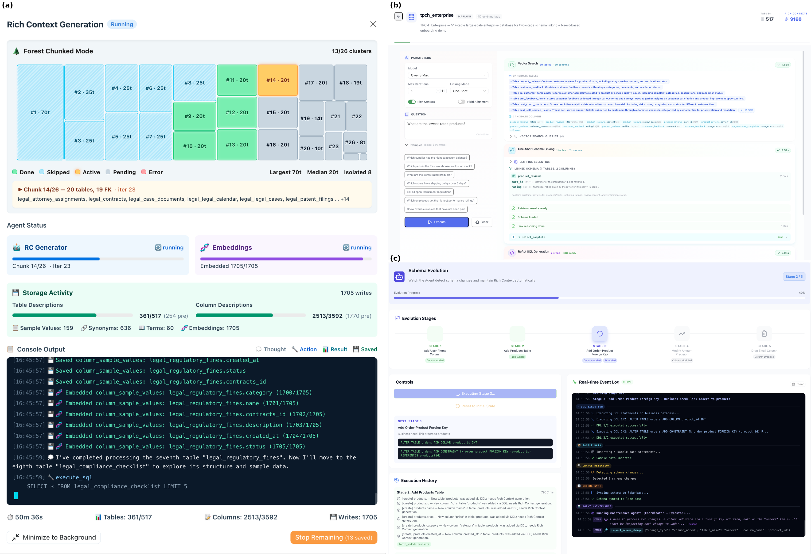
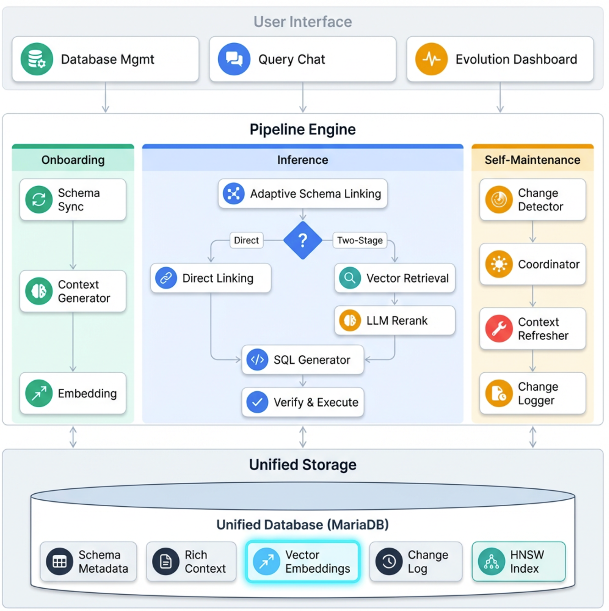

# ATLAS

**A**daptive **T**ext-to-SQL with **L**ifecycle-**A**ware **S**elf-maintaining Context

> VLDB 2026 Demo Track

ATLAS 将 Schema 元数据、语义标注和向量嵌入全部存储在单一 RDBMS 内——无外部向量库、无一致性问题、完整 ACID 保障。

[](LICENSE)
[](deploy/docker-compose.yml)
[](#评估结果)

<p align="center">
  
</p>
<p align="center"><em>(a) 517 表 Forest-Chunked Onboarding &nbsp; (b) 两阶段自适应查询 &nbsp; (c) 自主 Schema 演进</em></p>

## 核心创新

### 1. 库内统一存储

Schema、Rich Context、关系图谱、向量嵌入（HNSW）和变更审计日志全部存放在 MariaDB 12 的 `rc_*` 系列表中，一条 SQL 即可同时做向量相似度搜索和关系型过滤。

### 2. 两阶段自适应 Schema Linking

- **小规模** (≤30 表)：全量 Schema 直接发给 LLM 做 one-shot linking。
- **大规模** (>30 表)：向量检索在亚秒级内将 500+ 张表缩减到 ~20 个候选；LLM 再做精确推理。

### 3. Rich Context 生命周期

| 阶段 | 描述 |
|------|------|
| **Onboarding** | ReAct Agent 采样数据，为每列生成描述/同义词/业务规则，嵌入 HNSW 索引 |
| **Inference** | 向量检索召回相关 Context 注入 LLM prompt，辅助语义消歧 |
| **Evolution** | DDL 变更检测 → 标记过时 Context → LLM 重新生成 → 向量重新嵌入 |

大规模 Schema 使用 **Forest-Based Chunked** 策略，将 FK 图分解为连通子树并行处理。

### 4. Agent 驱动的自维持

Coordinator–Executor 架构：DDL 检测器对比 `information_schema` 差异 → Coordinator 标记过时条目 → Executor 调用 LLM 重新生成 → Change Logger 记录所有变更。

## 评估结果

**BIRD 开发集** (1,534 问题, 11 数据库)：

| 配置 | EX (%) | 平均迭代次数 |
|------|--------|------------|
| **完整 ATLAS 管线** | **76.40** | 3.37 |
| − ReAct 循环 (one-shot + RC) | 68.71 | 1.00 |
| − 业务规则与值映射 | 72.04 | 3.62 |
| − 样例值与同义词 | 70.86 | 3.91 |
| 仅 Schema (无 Rich Context) | 65.45 | 4.49 |
| 基线 (直接生成) | 58.93 | 1.00 |

**系统级消融实验** — TPC-H Enterprise (500+ 表, 30 个跨域查询)：

| 配置 | Recall@20 | EX (%) | 延迟 (s) |
|------|-----------|--------|---------|
| 完整 ATLAS 管线 | **93.3** | **70.0** | 4.8 |
| − 自适应 Linking | — (溢出) | — | 超时 |
| − 向量检索 | 66.7 | 50.0 | 5.6 |
| − ReAct 循环 | 93.3 | 56.7 | 2.3 |
| − Rich Context | 80.0 | 53.3 | 4.9 |

> 详细消融结果: [AtlasCore](https://github.com/Zqzqsb/AtlasCore)

## 系统架构

<p align="center">
  
</p>
<p align="center"><em>三条管线 — Onboarding、Inference、Self-Maintenance — 共享库内统一存储 (rc_* 表)。</em></p>

## 快速开始

```bash
git clone https://github.com/Zqzqsb/atlas.git
cd atlas

# 一条命令：自动从 .example 生成配置、构建、启动，并做健康/数据源自检
make
```

随后访问 **http://localhost:19000**。

### Demo 出厂预置 —— 无需 API key 即可体验

首次启动会加载单一种子文件（`deploy/init/mariadb/01_atlas_demo.sql.gz`），还原**完整可用的 demo**：五个数据源、它们的 Rich Context，以及**预计算好的 2048 维向量 embedding**。因此**冷启动即可**进行 schema 浏览和自适应**向量检索**演示，**无需任何 embedding/LLM API key**。

若要运行实时 SQL 生成和 onboarding agent，再补一个模型 key：

```bash
# 编辑自动生成的配置 — LLM + Embedding 的 API Key 集中在一个文件
$EDITOR llm_config.json
# 填写：模型的 "token" 字段  +  "_embedding.api_key"
make rebuild   # 重新加载 key；占位未填时 `make` 会红色提示
```

### 常用命令

| 命令 | 作用 |
|---|---|
| `make` / `make rebuild` | 构建 + 启动（保留数据），并自检 |
| `make clean-build` | 全新冷启动，从 dump 重新播种（会二次确认） |
| `make doctor` | 诊断配置 / 容器 / 数据源 |
| `make down` | 停止所有容器 |

> **Go 代理**：国内默认使用 `goproxy.cn`；海外可用 `make PROXY=https://proxy.golang.org,direct`
>
> demo 默认数据库密码（`atlas2024`）在 `.env.example` / `docker-compose.yml` 中。
> 任何非本地部署请通过 `.env` 修改。

## 技术栈

| 组件 | 技术 |
|------|------|
| 数据库 | MariaDB 12 (原生 VECTOR + HNSW) |
| 后端 | Go 1.24 + Gin |
| 前端 | Vue 3 + Vite + UnoCSS + Naive UI |
| LLM | 任意 OpenAI 兼容 API |
| 嵌入模型 | 任意 OpenAI 兼容 Embedding API |
| 部署 | Docker Compose (3 容器) |

## 项目结构

```
atlas/
├── backend/              # Go 后端
│   ├── internal/
│   │   ├── lakebase/         # 湖基存储层 (rc_* 表)
│   │   ├── agent/            # 自维持 Agent
│   │   ├── grounding/        # Schema Linking
│   │   ├── inference/        # ReAct 推理引擎
│   │   ├── embedding/        # 向量嵌入
│   │   ├── context/          # Rich Context 管理
│   │   ├── adapter/          # 数据库适配器
│   │   └── llm/              # LLM 客户端
│   └── server/               # HTTP API + SSE
├── frontend/             # Vue 3 + Vite + UnoCSS + Naive UI
├── deploy/               # Docker Compose 配置
├── docs/                 # 图片与文档
└── scripts/              # 工具脚本
```

## 引用

```bibtex
@inproceedings{atlas2026vldb,
  title     = {ATLAS: Adaptive Text-to-SQL with Lifecycle-Aware Self-maintaining Context},
  author    = {Anonymous},
  booktitle = {Proceedings of the VLDB Endowment, Demo Track},
  year      = {2026}
}
```

## 许可证

[Apache License 2.0](LICENSE)

## 致谢

- MariaDB Foundation 提供原生 VECTOR 支持
- [BIRD](https://bird-bench.github.io/) 和 [Spider](https://yale-lily.github.io/spider) 基准测试
